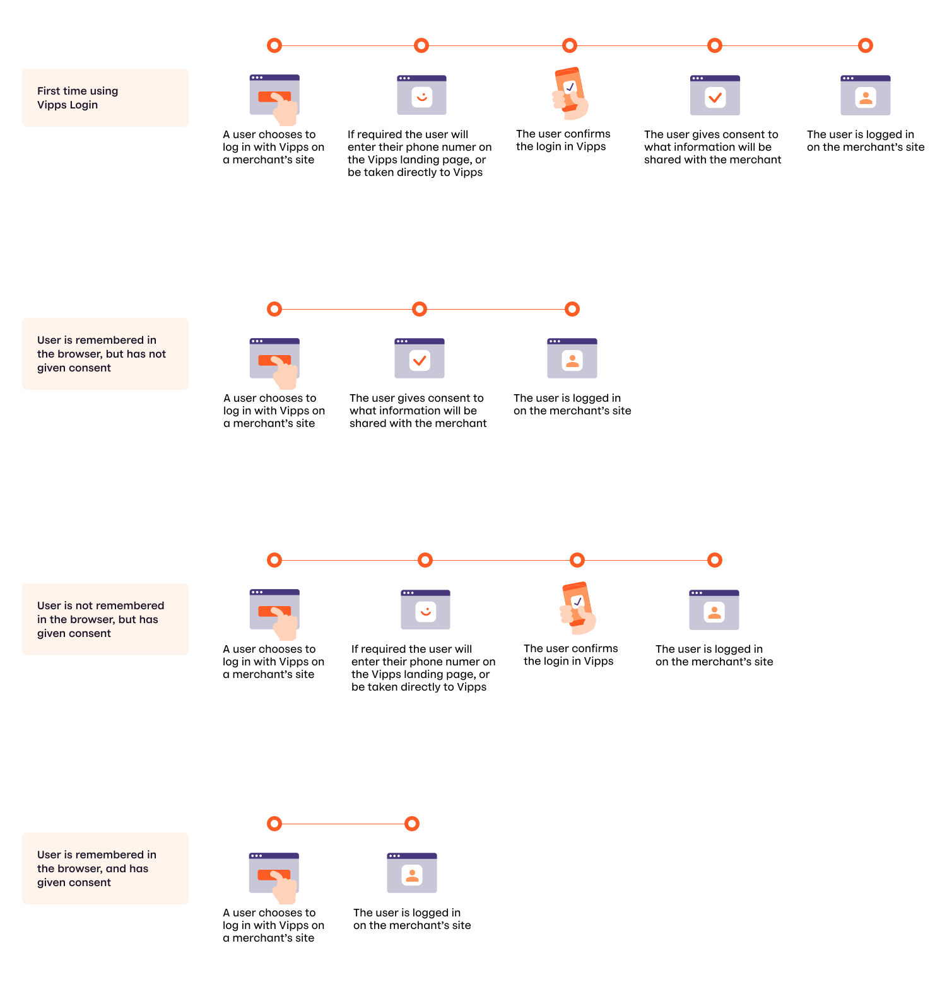
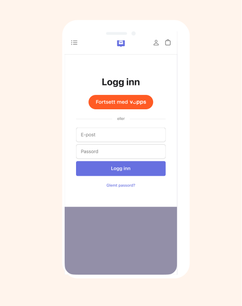

<!-- START_METADATA
---
title: How it works in the browser
sidebar_position: 13
---
END_METADATA -->

# How it works in the browser

<!-- START_COMMENT -->

ℹ️ Please use the new documentation:
[Vipps Technical Documentation](https://vippsas.github.io/vipps-developer-docs/).

<!-- END_COMMENT -->

Let your customers log in to your website or app without the need for user names and passwords.

For technical documentation go to
[Vipps Login API](https://vippsas.github.io/vipps-developer-docs/docs/APIs/login-api).

We also have _How it works_ for [Vipps Login from phone number](vipps-login-from-phone-number-api-howitworks.md)

## The login process

## The first time using Vipps Login

### 1. Log in with Vipps

A user chooses to log in with Vipps on a merchant’s site.

### 2. The Vipps landing page

If the login was started on a desktop device, the user will be sent to the Vipps landing page. If the user is not remembered in browser from earlier, the user enters their phone number and can choose to be remembered in the browser for a quicker login the next time. The "Remember me in browser" option applies to the browser, independent of merchants. This option is default off on desktop devices.

The user is then prompted to log in to Vipps and follow the instructions in the app.

If the login was started from a mobile device and the user needs to authenticate in the app, the user will confirm to be taken to the Vipps-app without having to enter their phone number.

### 3. E-mail verification (first time only)

If the merchant has requested the user's e-mail address, the user have to verify their e-mail address in Vipps the first time they use Vipps login, or if they change their e-mail address at a later time.

The user can check and change their registered e-mail addresses. This is only necessary to do once. If the merchant has not requested the user's e-mail address, this step is skipped.

### 4. Confirm login

The user confirms the login in the Vipps-app.

If the login was started on a phone, the user can in this step choose to be remembered in the browser for a quicker registration or login the next time. The "Remember me in browser" option is default on for mobile devices.

If the login was started on desktop, the user confirms that the emoji in Vipps matches the one on the landing page, and confirms the login.

### 5. Give consent to share information

The user gives consent to share information with the merchant.

The user may click "See your information" to see the actual information that will be shared, but this is optional.

### 6. Logged in

The user is now logged in on the merchant’s page.

The user may be given the opportunity to edit the information, for instance
to add additional details not present in the user's Vipps profile.

## Great! Now you know how the Vipps Login process works.

Take a look at the technical documentation in the [Vipps Login API Guide](../api-guide/README.md).
