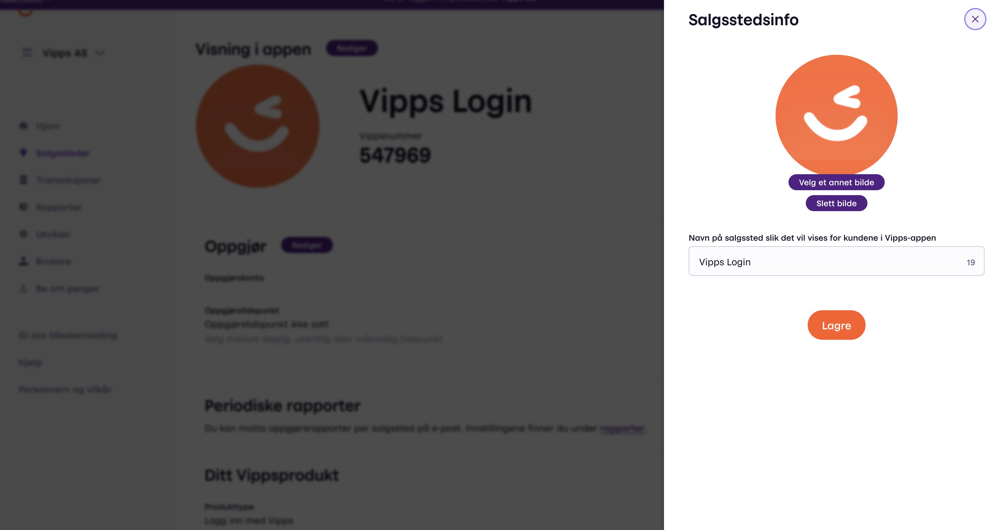
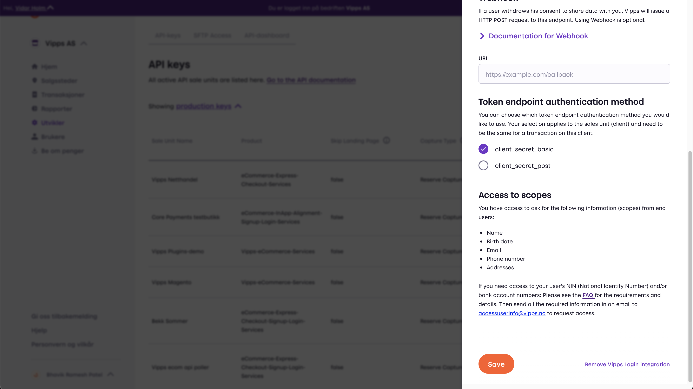

# Vipps Login API: Frequently Asked Questions

See the [Vipps Login API](https://github.com/vippsas/vipps-login-api/blob/master/vipps-login-api.md) for all the details.

See also the
[Getting Started](https://github.com/vippsas/vipps-developers/blob/master/vipps-getting-started.md)
guide for
[portal.vipps.no](https://portal.vipps.no).
You can also find frequently asked questions in the
[Product FAQ](https://vipps.no/hjelp/vipps/vipps-logg-inn).

Document version 2.0.4.

## Table of contents

- [Where do I find the `client_id` and `client_secret`?](#where-do-i-find-the-client_id-and-client_secret)
- [How can I activate and set up Vipps login?](#how-can-i-activate-and-set-up-vipps-login)
- [What are the requirements for Redirect URIs?](#what-are-the-requirements-for-redirect-uris)
- [How can I change the name and logo shown with Vipps login?](#how-can-i-change-the-name-and-logo-shown-with-vipps-login)
- [Why do I get “Error: invalid_client”?](#why-do-i-get-error-invalid_client)
- [Why do I get “Error: Could not get Vipps login token” in the Vipps app?](#Why-do-I-get-Error-Could-not-get-Vipps-login-token-in-the-Vipps-app)
- [Which scopes can I use? Why do I get “Invalid_scope”?](#which-scopes-can-i-use-why-do-i-get-invalid_scope)
- [If a user changes phone numbers, is the `sub` still the same?](#if-a-user-changes-phone-numbers-is-the-sub-still-the-same)
- [Who can get access to NIN and how?](#who-can-get-access-to-nin-and-how)
- [Who can get access to account numbers and how?](#who-can-get-access-to-accountnumbers-and-how)
- [What's the purpose of the state parameter?](#whats-the-purpose-of-the-state-parameter)
- [Is it possible for me as a merchant to control whether the user can log in through being remembered in browser or need to use the app to authenticate (two factor authentication)??](#is-it-possible-for-me-as-a-merchant-to-control-whether-the-user-can-log-in-through-being-remembered-in-browser-or-need-to-use-the-app-to-authenticate-two-factor-authentication)
- [How can I use client_secret_post for authentication?](#how-can-i-use-client_secret_post-for-authentication)
- [Common errors](#common-errors)

## Where do I find the `client_id` and `client_secret`?

You find more information in
[Getting started](https://github.com/vippsas/vipps-developers/blob/master/vipps-getting-started.md#getting-the-api-keys).

Be aware that you do _not_ use the API-keys for Vipps login, just the `client_id`
and `client_secret`.

If you cannot access [portal.vipps.no](https://portal.vipps.no): do you have a
user for the merchant? The person who were added as the contact person in the
request is set as the administrator and can add new users. If you have added a
new service to an existing merchant, you need to have the existing administrator
add new users if required.

If you can login to [portal.vipps.no](https://portal.vipps.no) but cannot see
the “developer” selection in the top-menu you need to have the administrator
grant you developer access for the sales unit you need access to.

## How can I activate and set up Vipps login?

On [portal.vipps.no](https://portal.vipps.no), in the same place as the client
ID and `client_secret` described above, you can activate Vipps login, and also
add the redirect URIs needed for the service to work. This is the URL/URI of
the page which the user is redirected to after finishing a login. See more on
this in the
[documentation](https://github.com/vippsas/vipps-login-api/blob/master/vipps-login-api.md#api-endpoints)
as well as requirements for the URIs below.

You will find the Setup Vipps login option in the same place as you find your
`client_id` and `client_secret` (click "setup login" to get started):

First you activate Vipps login:

Then you can add the redirect URIs you need:

## What are the requirements for Redirect URIs?

We validate redirect URIs against a white list of pre-approved URIs. The URIs
need to be registered on [portal.vipps.no](https://portal.vipps.no), and you
can register as many as you want to. You specify the URI that will be used with
the query parameter `redirect_uri` on the initial request to the authentication
endpoint.

You can use localhost as part of the redirect URI.

You can use “Custom URL Scheme” in the redirect URIs to redirect back an app. In this case a path is required: myapp://path-to-something.

## How can I change the name and logo shown with Vipps login?

Vipps login will show the name of the sales unit you use in the different Vipps login user dialogues. This includes the confirm login screen, the give consent screen and the overview of consents given.

You can administer this name for `production` in [portal.vipps.no](https://portal.vipps.no). Unfortunatly you cannon change the name used for the test environment. To change your display name in production you go to sales units ("salgssteder") in the left menu and select the correct unit. From this page you can see the key information for this sales unit:
. You go to the sales unit ("salgssted") and click the correct unit. From this page you can see the key information for this sales unit:](images/Sales_unit_see_info.png)

By clicking "Rediger" next to the "Visning i appen" heading you will come to a screen where you both can update your name and ad your logo:

Currently this logo is not use for Vipps login but soon it will be shown in the overview of consents given.

## Why do I get “Error: invalid_client”?

This means that the `client_id` and `client_secret` used is not valid for Vipps login.

Please check:
Are you using the `client_id` and `client_secret` for the correct environment?
There are separate keys for test and production. Both available on
[portal.vipps.no](https://portal.vipps.no) under “Developer”. You can choose
the environment above the table with sales units.

Have you set up a redirect URI for login with Vipps in the environment in question?

## Why do I get “Error: Could not get Vipps login token” in the Vipps app?

You can get this error if you have both the Vipps test app and production app on the same phone.

As stated in the [description of the test apps](https://github.com/vippsas/vipps-developers#vipps-test-apps):
"Please note: App-switching on iOS uses the same URL pattern for both the production Vipps app (in App Store) and the MT test app (in TestFlight). This means that iOS may open either of the apps for a vipps:// URL, as iOS can not know which of the apps to open. Because of this, we recommend to only have one of the apps installed on the same device."

## Which scopes can I use? Why do I get “Invalid_scope”?

If you get “Invalid_scope” this means that you have included one or more scopes
that you do not have access to or that is not supported. You will find the list
of supported scopes here:
https://github.com/vippsas/vipps-login-api/blob/master/vipps-login-api.md#scopes

All merchants get access to these scopes:
* openid
* address
* birthdate
* email
* name
* phoneNumber

**Important:** You should not ask for more scopes than you need for your
application. The user will need to consent to sharing the information with you
so adding more scopes increases the chance that they will decline.

The scopes “openid” is required and does not require end user consent. It
provides the claim “sub” which is a unique id for the end user at that
particular merchant. Note: Different merchants will get different subs for the same end user.

Some merchants can get access to NIN. Merchants need to request this separately.

## If a user changes phone numbers, is the `sub` still the same?

Yes, it's connected to the national identity number (nin).

## Who can get access to NIN and how?

Access to NIN is a paid service.
Only merchants with legal requirements or other objective needs to use Norwegian
National Identity Number (NIN) to achieve required user identification can get
access to NIN.  We correspond to
[the guidance from Datatilsynet](https://www.datatilsynet.no/rettigheter-og-plikter/personopplysninger/fodselsnummer/)
on this.

According to this NIN can only be used when it is legally required or when
there is a need for a secure identification of the person and the NIN is
required to achieve this. This applies e.g. when a company is required to
report to the tax authorities or within healthcare and credit.

Keeping a unique and consistent identifier for the user over time is not a
sufficient requirement. For this purpose Vipps offers a unique merchant specific
user identifier that are delivered as part of the registration/login. This is
the claim "sub" that is delivered based on the "openid" scope. This unique
identifier will allow you to keep a consistent user profile even if the user
changes contact information.

Beware that login with Vipps it not an electronic ID. Thus the NIN can only be
used to simplify the customers processes by removing manual input or to lookup
the customer in your own or external registers. This can be done as part of the
processes to become a customer or to link login with Vipps to an existing user.
If you need to store the NIN for new users we recommend that you use an
electronic ID, e.g  BankID.

Merchants need to apply for access to NIN separately by sending an email to
accessuserinfo@vipps.no. In the email you should specify:
* Merchant name
* Organization number
* Name and number of the sale unit from [portal.vipps.no](https://portal.vipps.no)
* Information on how you plan to use the NIN
* The legal requirement and/or the reason why you need to use NIN to achieve
  required user identification.

## Who can get access to account numbers and how?

Access to account numbers is a paid service.
Merchants need to order access to account numbers separately by sending an email
to accessuserinfo@vipps.no. In the email you should specify:
* Merchant name
* Organization number
* Name and number of the sale unit from [portal.vipps.no](https://portal.vipps.no)
* Information on how you plan to use the account numbers

## What's the purpose of the state parameter?
The state parameter is an opaque value used by the client to maintain state between the request and callback. The authorization server includes this value when redirecting the user-agent back to the client. The parameter should be used for preventing cross-site request forgery.

## Is it possible for me as a merchant to control whether the user can log in through being remembered in browser or need to use the app to authenticate (two factor authentication)?

Vipps login do not currently support merchants specifying that the user needs to use the app to authenticate (two factor authentication). The end-user chooses whether he would like to be remembered in browser or not.  

## How can I use client_secret_post for authentication?
It is possible to change token endpoint authentication method on [portal.vipps.no](https://portal.vipps.no).

Under the “Developer” section you will find the Setup Vipps login option for your sale units.

You have the option to change the token endpoint authentication method, and see which method is currently active:

## Common errors

Certain versions of Chrome gives the error `No+CSRF+value+available+in+the+session+cookie`.
Upgrading to the latest version of Chrome should solve this.

If the `redirect_url` is using a custom URL scheme, such as `myapp://`, a path
is required: `myapp://path-to-something`.

## Questions?

We're always happy to help with code or other questions you might have!
Please create an [issue](https://github.com/vippsas/vipps-login-api/issues),
a [pull request](https://github.com/vippsas/vipps-login-api/pulls),
or [contact us](https://github.com/vippsas/vipps-developers/blob/master/contact.md).

Sign up for our [Technical newsletter for developers](https://github.com/vippsas/vipps-developers/tree/master/newsletters).
